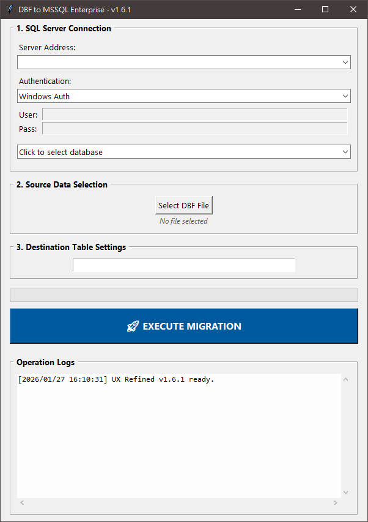

# DBF-SQL-Converter-TW


A professional Python-based converter for migrating legacy DBF data to Microsoft SQL Server. Optimized for high-speed data streaming and secure environment management.

## 📸 Interface Preview
<p align="center">
  
  <br>
  <em>Clean, multi-threaded GUI with real-time operation logging.</em>
</p>

## ⚡ Performance Benchmark
This project addresses the I/O bottlenecks common in standard database migration scripts. By implementing `pyodbc`'s `fast_executemany` along with optimized memory cleaning:

* **Standard Row-by-Row Insertion:** ~49 seconds
* **Optimized Batch Streaming:** **~3 seconds**
* **Improvement:** **15x Faster** than conventional methods.

## ✨ Key Features
* **Multi-Auth Support:** Supports Windows Authentication, SQL Server Auth (UID/PWD), and Azure Active Directory.
* **Responsive Architecture:** Multi-threaded design prevents GUI freezing during heavy data tasks.
* **Auto-Persistence:** Automatically saves server history and connection preferences via `config.json`.
* **Smart Schema Mapping:** Intelligent mapping of DBF field types (C, N, D, L, M, F) to native MSSQL types.
* **Security Focused:** No hardcoded credentials. Input fields are automatically cleared when switching auth modes to prevent accidental leaks.

## 🚀 Installation & Usage

### 1. Prerequisites
Ensure the **ODBC Driver 17 for SQL Server** is installed on your Windows environment.

### 2. Setup
```bash
# Clone this repository
git clone [https://github.com/YourUsername/DBF-SQL-Converter-TW.git](https://github.com/YourUsername/DBF-SQL-Converter-TW.git)

# Install required packages
pip install -r requirements.txt